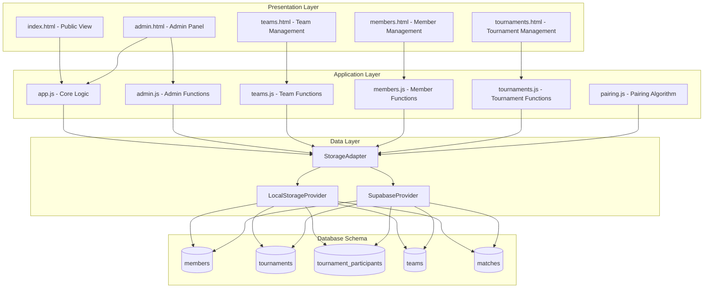

# Design Document: Tournament Member Management System

## Overview

This design extends the existing single-tournament Pickleball application into a comprehensive multi-tournament management system with member database, automated team pairing, and enhanced match scheduling capabilities. The system will maintain backward compatibility with the existing codebase while introducing new database tables, UI pages, and algorithms for tournament creation and management.

### Key Design Goals

1. **Multi-Tournament Support**: Enable creation and management of multiple tournaments with independent data
2. **Member Database**: Centralized member registry with tier-based skill classification
3. **Automated Pairing**: Intelligent team formation based on skill tiers and seeding
4. **Flexible Match Types**: Support group stage, semifinals, finals, third-place, consolation, and exhibition matches
5. **Backward Compatibility**: Preserve existing functionality while extending capabilities
6. **Dual-Mode Operation**: Continue supporting both localStorage (demo) and Supabase (production) modes

## Architecture

### System Architecture



### Component Responsibilities

**Presentation Layer**:
- `members.html`: Member CRUD interface with filtering and search
- `tournaments.html`: Tournament list, creation wizard, and history
- Existing pages extended with tournament selector dropdown

**Application Layer**:
- `members.js`: Member management operations
- `tournaments.js`: Tournament lifecycle management
- `pairing.js`: Team pairing algorithm implementation
- `StorageAdapter`: Abstraction layer for data persistence

**Data Layer**:
- Unified interface for localStorage and Supabase
- Transaction support for multi-table operations
- Realtime sync for Supabase mode

## Components and Interfaces

### 1. Storage Adapter

Provides unified interface for both storage backends:

```javascript
class StorageAdapter {
  constructor(mode) {
    this.provider = mode === 'supabase' 
      ? new SupabaseProvider() 
      : new LocalStorageProvider();
  }
  
  // CRUD operations
  async create(table, data) { }
  async read(table, filters) { }
  async update(table, id, data) { }
  async delete(table, id) { }
  
  // Transaction support
  async transaction(operations) { }
  
  // Realtime subscriptions
  subscribe(table, callback) { }
  unsubscribe(channel) { }
}
```

### 2. Member Management Module

```javascript
// members.js
class MemberManager {
  constructor(storage) {
    this.storage = storage;
  }
  
  async createMember(data) {
    // Validate: name (required), tier (1-3, required)
    // Optional: email, phone
    return await this.storage.create('members', data);
  }
  
  async updateMember(id, data) {
    return await this.storage.update('members', id, data);
  }
  
  async deleteMember(id) {
    // Check if member is in any active tournament
    return await this.storage.delete('members', id);
  }
  
  async searchMembers(query, tierFilter) {
    // Filter by name substring and/or tier
    return await this.storage.read('members', { query, tierFilter });
  }
  
  async exportMembers() {
    // Generate CSV file
  }
  
  async importMembers(csvData) {
    // Parse CSV and bulk insert
  }
}
```

### 3. Tournament Management Module

```javascript
// tournaments.js
class TournamentManager {
  constructor(storage) {
    this.storage = storage;
  }
  
  async createTournament(basicInfo) {
    // Step 1: Create tournament record
    const tournament = await this.storage.create('tournaments', {
      name: basicInfo.name,
      start_date: basicInfo.startDate,
      status: 'upcoming',
      config: {
        numGroups: basicInfo.numGroups || 2,
        teamsPerGroup: basicInfo.teamsPerGroup || 5,
        enableConsolation: basicInfo.enableConsolation || false
      }
    });
    
    return tournament;
  }
  
  async addParticipants(tournamentId, participants) {
    // Step 2: Add members to tournament with tier overrides
    const records = participants.map(p => ({
      tournament_id: tournamentId,
      member_id: p.memberId,
      tier_override: p.tierOverride || null,
      is_seeded: p.isSeeded || false
    }));
    
    return await this.storage.create('tournament_participants', records);
  }
  
  async generateTeams(tournamentId) {
    // Step 3: Run pairing algorithm
    const participants = await this.storage.read('tournament_participants', {
      tournament_id: tournamentId
    });
    
    const pairing = new PairingAlgorithm(participants);
    const teams = await pairing.generateTeams();
    
    return await this.storage.create('teams', teams);
  }
  
  async generateSchedule(tournamentId) {
    // Step 4: Create round-robin matches
    const teams = await this.storage.read('teams', {
      tournament_id: tournamentId
    });
    
    const matches = this.createRoundRobinSchedule(teams);
    return await this.storage.create('matches', matches);
  }
  
  async setActiveTournament(tournamentId) {
    localStorage.setItem('active_tournament_id', tournamentId);
  }
  
  async getActiveTournament() {
    const id = localStorage.getItem('active_tournament_id');
    return await this.storage.read('tournaments', { id });
  }
}
```

### 4. Pairing Algorithm Module

```javascript
// pairing.js
class PairingAlgorithm {
  constructor(participants) {
    this.participants = participants;
  }
  
  generateTeams() {
    // 1. Separate by tier (using tier_override if present)
    const tier1 = this.participants.filter(p => this.getTier(p) === 1);
    const tier2 = this.participants.filter(p => this.getTier(p) === 2);
    const tier3 = this.participants.filter(p => this.getTier(p) === 3);
    
    // 2. Separate seeded players
    const seeded = this.participants.filter(p => p.is_seeded);
    
    // 3. Pair Tier 1 + Tier 3
    const teams13 = this.pairTiers(tier1, tier3);
    
    // 4. Pair Tier 2 + Tier 2
    const teams22 = this.pairTiers(tier2, tier2);
    
    // 5. Distribute seeded players evenly across groups
    const allTeams = [...teams13, ...teams22];
    return this.distributeToGroups(allTeams, seeded);
  }
  
  getTier(participant) {
    return participant.tier_override || participant.member.tier;
  }
  
  pairTiers(listA, listB) {
    // Shuffle for randomness
    const shuffledA = this.shuffle(listA);
    const shuffledB = this.shuffle(listB);
    
    const teams = [];
    const maxPairs = Math.min(shuffledA.length, shuffledB.length);
    
    for (let i = 0; i < maxPairs; i++) {
      teams.push({
        member1_id: shuffledA[i].member_id,
        member2_id: shuffledB[i].member_id,
        is_seeded: shuffledA[i].is_seeded || shuffledB[i].is_seeded
      });
    }
    
    return teams;
  }
  
  distributeToGroups(teams, seededPlayers) {
    // Get config for number of groups
    const numGroups = this.getNumGroups();
    const groups = Array.from({ length: numGroups }, () => []);
    
    // First, distribute seeded teams evenly
    const seededTeams = teams.filter(t => t.is_seeded);
    seededTeams.forEach((team, idx) => {
      const groupIdx = idx % numGroups;
      team.group_name = String.fromCharCode(65 + groupIdx); // A, B, C...
      groups[groupIdx].push(team);
    });
    
    // Then distribute remaining teams
    const nonSeededTeams = teams.filter(t => !t.is_seeded);
    nonSeededTeams.forEach((team, idx) => {
      const groupIdx = idx % numGroups;
      team.group_name = String.fromCharCode(65 + groupIdx);
      groups[groupIdx].push(team);
    });
    
    return teams;
  }
  
  shuffle(array) {
    // Fisher-Yates shuffle
    const result = [...array];
    for (let i = result.length - 1; i > 0; i--) {
      const j = Math.floor(Math.random() * (i + 1));
      [result[i], result[j]] = [result[j], result[i]];
    }
    return result;
  }
}
```

### 5. Schedule Generation

```javascript
// In TournamentManager
createRoundRobinSchedule(teams) {
  const matches = [];
  
  // Group teams by group_name
  const groups = {};
  teams.forEach(team => {
    if (!groups[team.group_name]) groups[team.group_name] = [];
    groups[team.group_name].push(team);
  });
  
  // Generate round-robin for each group
  Object.entries(groups).forEach(([groupName, groupTeams]) => {
    for (let i = 0; i < groupTeams.length; i++) {
      for (let j = i + 1; j < groupTeams.length; j++) {
        matches.push({
          tournament_id: groupTeams[i].tournament_id,
          teamA: this.getTeamName(groupTeams[i]),
          teamB: this.getTeamName(groupTeams[j]),
          scoreA: 0,
          scoreB: 0,
          group_name: groupName,
          stage: 'group',
          match_type: 'group',
          status: 'not_started',
          updated_at: null
        });
      }
    }
  });
  
  return matches;
}

getTeamName(team) {
  if (team.name) return team.name;
  // Fetch member names and combine
  const member1 = this.getMemberName(team.member1_id);
  const member2 = this.getMemberName(team.member2_id);
  return `${member1} & ${member2}`;
}
```

## Data Models

### Database Schema

#### 1. members Table

```sql
CREATE TABLE members (
  id SERIAL PRIMARY KEY,
  name VARCHAR(255) NOT NULL,
  email VARCHAR(255),
  phone VARCHAR(50),
  tier INTEGER NOT NULL CHECK (tier IN (1, 2, 3)),
  created_at TIMESTAMP DEFAULT NOW()
);

CREATE INDEX idx_members_tier ON members(tier);
CREATE INDEX idx_members_name ON members(name);
```

**Fields**:
- `id`: Auto-increment primary key
- `name`: Member full name (required)
- `email`: Contact email (optional)
- `phone`: Contact phone (optional)
- `tier`: Skill level 1 (high), 2 (medium), 3 (low) - required
- `created_at`: Timestamp of creation

#### 2. tournaments Table

```sql
CREATE TABLE tournaments (
  id SERIAL PRIMARY KEY,
  name VARCHAR(255) NOT NULL,
  start_date DATE NOT NULL,
  status VARCHAR(20) NOT NULL CHECK (status IN ('upcoming', 'ongoing', 'completed')),
  config JSONB DEFAULT '{}',
  archived BOOLEAN DEFAULT FALSE,
  created_at TIMESTAMP DEFAULT NOW()
);

CREATE INDEX idx_tournaments_status ON tournaments(status);
CREATE INDEX idx_tournaments_start_date ON tournaments(start_date);
```

**Fields**:
- `id`: Auto-increment primary key
- `name`: Tournament name (required)
- `start_date`: Tournament start date (required)
- `status`: One of 'upcoming', 'ongoing', 'completed'
- `config`: JSON object containing:
  - `numGroups`: Number of groups (default 2)
  - `teamsPerGroup`: Teams per group (default 5)
  - `enableConsolation`: Enable consolation match (default false)
  - `enableThirdPlace`: Enable third place match (default true)
- `archived`: Whether tournament is archived
- `created_at`: Timestamp of creation

#### 3. tournament_participants Table

```sql
CREATE TABLE tournament_participants (
  id SERIAL PRIMARY KEY,
  tournament_id INTEGER NOT NULL REFERENCES tournaments(id) ON DELETE CASCADE,
  member_id INTEGER NOT NULL REFERENCES members(id) ON DELETE CASCADE,
  tier_override INTEGER CHECK (tier_override IN (1, 2, 3)),
  is_seeded BOOLEAN DEFAULT FALSE,
  UNIQUE(tournament_id, member_id)
);

CREATE INDEX idx_tp_tournament ON tournament_participants(tournament_id);
CREATE INDEX idx_tp_member ON tournament_participants(member_id);
```

**Fields**:
- `id`: Auto-increment primary key
- `tournament_id`: Foreign key to tournaments
- `member_id`: Foreign key to members
- `tier_override`: Temporary tier for this tournament only (optional)
- `is_seeded`: Whether member is seeded player
- Unique constraint on (tournament_id, member_id)

#### 4. teams Table

```sql
CREATE TABLE teams (
  id SERIAL PRIMARY KEY,
  tournament_id INTEGER NOT NULL REFERENCES tournaments(id) ON DELETE CASCADE,
  name VARCHAR(255),
  member1_id INTEGER NOT NULL REFERENCES members(id),
  member2_id INTEGER NOT NULL REFERENCES members(id),
  group_name VARCHAR(10) NOT NULL,
  is_seeded BOOLEAN DEFAULT FALSE,
  created_at TIMESTAMP DEFAULT NOW()
);

CREATE INDEX idx_teams_tournament ON teams(tournament_id);
CREATE INDEX idx_teams_group ON teams(tournament_id, group_name);
```

**Fields**:
- `id`: Auto-increment primary key
- `tournament_id`: Foreign key to tournaments
- `name`: Custom team name (optional, auto-generated if null)
- `member1_id`: First team member
- `member2_id`: Second team member
- `group_name`: Group identifier (A, B, C, etc.)
- `is_seeded`: Whether team contains seeded player
- `created_at`: Timestamp of creation

#### 5. matches Table (Extended)

```sql
-- Extend existing matches table
ALTER TABLE matches ADD COLUMN tournament_id INTEGER REFERENCES tournaments(id) ON DELETE CASCADE;
ALTER TABLE matches ADD COLUMN match_type VARCHAR(20) DEFAULT 'group' 
  CHECK (match_type IN ('group', 'semi', 'final', 'third_place', 'consolation', 'exhibition'));

CREATE INDEX idx_matches_tournament ON matches(tournament_id);
CREATE INDEX idx_matches_type ON matches(match_type);
```

**New Fields**:
- `tournament_id`: Foreign key to tournaments
- `match_type`: Type of match (group, semi, final, third_place, consolation, exhibition)

**Existing Fields** (preserved):
- `id`, `teamA`, `teamB`, `scoreA`, `scoreB`, `status`, `stage`, `group_name`, `updated_at`
- Set scores: `s1a`, `s1b`, `s2a`, `s2b`, `s3a`, `s3b`
- Set locks: `s1_locked`, `s2_locked`, `s3_locked`
- Match info: `match_time`, `court`, `referee`

### LocalStorage Schema

For demo mode, data stored as JSON objects:

```javascript
{
  "pb_members": [
    { id: "m1", name: "...", tier: 1, email: "...", phone: "..." }
  ],
  "pb_tournaments": [
    { id: "t1", name: "...", start_date: "...", status: "...", config: {...} }
  ],
  "pb_tournament_participants": [
    { id: "tp1", tournament_id: "t1", member_id: "m1", tier_override: null, is_seeded: false }
  ],
  "pb_teams": [
    { id: "team1", tournament_id: "t1", member1_id: "m1", member2_id: "m2", group_name: "A" }
  ],
  "pb_matches": [
    { id: "a1", tournament_id: "t1", teamA: "...", teamB: "...", ... }
  ],
  "active_tournament_id": "t1"
}
```

## UI/UX Design

### 1. members.html - Member Management Page

**Layout**:
```
┌─────────────────────────────────────────────────────┐
│ Header: "Quản Lý Thành Viên"                       │
│ [+ Thêm Thành Viên]  [Export CSV]  [Import CSV]    │
├─────────────────────────────────────────────────────┤
│ Filters:                                            │
│ [Search: ___________]  [Tier: All ▼]               │
├─────────────────────────────────────────────────────┤
│ ┌─────────────────────────────────────────────┐   │
│ │ Member Card                                  │   │
│ │ Name: Tuấn Anh                    Tier: 1   │   │
│ │ Email: tuan@example.com                      │   │
│ │ Phone: 0123456789                            │   │
│ │ [✏️ Edit] [🗑️ Delete]                        │   │
│ └─────────────────────────────────────────────┘   │
│ ┌─────────────────────────────────────────────┐   │
│ │ Member Card                                  │   │
│ │ ...                                          │   │
│ └─────────────────────────────────────────────┘   │
└─────────────────────────────────────────────────────┘
```

**Features**:
- Grid/card layout for members
- Real-time search filtering
- Tier badge with color coding (Tier 1: gold, Tier 2: silver, Tier 3: bronze)
- Inline edit modal
- Confirmation dialog for delete
- CSV export/import buttons

### 2. tournaments.html - Tournament Management Page

**Layout**:
```
┌─────────────────────────────────────────────────────┐
│ Header: "Quản Lý Giải Đấu"                         │
│ [+ Tạo Giải Đấu Mới]                               │
├─────────────────────────────────────────────────────┤
│ Tabs: [Upcoming] [Ongoing] [Completed] [Archived]  │
├─────────────────────────────────────────────────────┤
│ ┌─────────────────────────────────────────────┐   │
│ │ Tournament Card                              │   │
│ │ 🏆 Giải Pickleball Tháng 3                  │   │
│ │ 📅 15/03/2025    Status: Upcoming           │   │
│ │ 👥 20 members    📊 2 groups                │   │
│ │ [👁️ View] [✏️ Edit] [🗑️ Delete] [📦 Archive]│   │
│ └─────────────────────────────────────────────┘   │
└─────────────────────────────────────────────────────┘
```

**Tournament Creation Wizard** (Multi-step modal):

**Step 1: Basic Info**
```
┌─────────────────────────────────────────┐
│ Tạo Giải Đấu Mới - Bước 1/4            │
├─────────────────────────────────────────┤
│ Tên giải đấu: [___________________]    │
│ Ngày bắt đầu: [📅 15/03/2025]          │
│ Số bảng đấu:  [2 ▼]                    │
│ Số đội/bảng:  [5 ▼]                    │
│                                         │
│ [Cancel]              [Next: Chọn TV →]│
└─────────────────────────────────────────┘
```

**Step 2: Select Participants**
```
┌─────────────────────────────────────────┐
│ Tạo Giải Đấu Mới - Bước 2/4            │
├─────────────────────────────────────────┤
│ Chọn thành viên tham gia:              │
│ [Search: ___________]  [Tier: All ▼]   │
│                                         │
│ ☑ Tuấn Anh (Tier 1) [Tier: 1▼] [⭐]   │
│ ☑ Hang Dang (Tier 3) [Tier: 3▼] [ ]   │
│ ☐ Khoa Hoang (Tier 2) [Tier: 2▼] [ ]  │
│ ...                                     │
│                                         │
│ Selected: 20/40 members                 │
│ [← Back]              [Next: Ghép đội →]│
└─────────────────────────────────────────┘
```

**Step 3: Team Pairing**
```
┌─────────────────────────────────────────┐
│ Tạo Giải Đấu Mới - Bước 3/4            │
├─────────────────────────────────────────┤
│ [🎲 Ghép Cặp Tự Động] [🔄 Ghép Lại]    │
│                                         │
│ Bảng A:                                 │
│ • Tuấn Anh (T1⭐) & Hang Dang (T3)     │
│ • Khoa Hoang (T2) & Phan Nguyen (T2)   │
│ ...                                     │
│                                         │
│ Bảng B:                                 │
│ • Dũng Nguyễn (T1⭐) & Minh Ngọc (T3)  │
│ ...                                     │
│                                         │
│ [← Back]              [Next: Lịch thi →]│
└─────────────────────────────────────────┘
```

**Step 4: Schedule**
```
┌─────────────────────────────────────────┐
│ Tạo Giải Đấu Mới - Bước 4/4            │
├─────────────────────────────────────────┤
│ [📅 Tạo Lịch Tự Động]                  │
│                                         │
│ Bảng A - 10 trận:                       │
│ 1. Team 1 vs Team 2  [Time] [Court]    │
│ 2. Team 3 vs Team 4  [Time] [Court]    │
│ ...                                     │
│                                         │
│ Options:                                │
│ ☑ Tạo trận tranh giải ba                │
│ ☐ Tạo trận tranh giải khuyến khích      │
│                                         │
│ [← Back]              [✓ Tạo Giải Đấu] │
└─────────────────────────────────────────┘
```

### 3. Updated admin.html - Tournament Selector

Add dropdown at top of admin panel:

```html
<div class="adm-tournament-selector">
  <label>Giải đấu:</label>
  <select id="tournament-select" onchange="switchTournament(this.value)">
    <option value="t1">Giải Pickleball Tháng 3 (Ongoing)</option>
    <option value="t2">Giải Pickleball Tháng 2 (Completed)</option>
  </select>
  <span class="tournament-status-badge ongoing">● Đang diễn ra</span>
</div>
```

### 4. Updated index.html - Tournament Selector

Add dropdown for public view:

```html
<div class="tournament-selector">
  <select id="public-tournament-select" onchange="switchPublicTournament(this.value)">
    <option value="t1">Giải Pickleball Tháng 3</option>
    <option value="t2">Giải Pickleball Tháng 2</option>
  </select>
</div>
```

## Correctness Properties

*A property is a characteristic or behavior that should hold true across all valid executions of a system—essentially, a formal statement about what the system should do. Properties serve as the bridge between human-readable specifications and machine-verifiable correctness guarantees.*

### Property 1: Tier Filter Correctness

*For any* list of members and any tier filter value (1, 2, or 3), all members in the filtered result SHALL have a tier matching the filter value.

**Validates: Requirements 1.8**

### Property 2: Search Query Correctness

*For any* list of members and any search query string, all members in the search result SHALL have names containing the query string (case-insensitive).

**Validates: Requirements 1.9**

### Property 3: Tier 1 + Tier 3 Pairing Rule

*For any* set of Tier 1 members and Tier 3 members, when the pairing algorithm generates teams, all teams SHALL consist of exactly one Tier 1 member and one Tier 3 member (considering tier_override if present).

**Validates: Requirements 5.2**

### Property 4: Tier 2 + Tier 2 Pairing Rule

*For any* set of Tier 2 members, when the pairing algorithm generates teams, all teams SHALL consist of exactly two Tier 2 members (considering tier_override if present).

**Validates: Requirements 5.3**

### Property 5: Seeded Player Distribution

*For any* number of seeded players S and number of groups G, when the pairing algorithm distributes seeded players across groups, the difference between the group with the most seeded players and the group with the fewest seeded players SHALL be at most 1 (i.e., distribution is as even as possible).

**Validates: Requirements 5.4**

### Property 6: Pairing Randomness

*For any* set of participants, when the pairing algorithm is executed twice with the same input, the resulting team arrangements SHALL differ with high probability (due to internal randomization via shuffle).

**Validates: Requirements 5.7**

### Property 7: Round-Robin Completeness and Count

*For any* group of N teams, when the schedule generation algorithm creates a round-robin schedule:
- Every pair of teams SHALL appear in exactly one match
- The total number of matches SHALL equal N × (N - 1) / 2

**Validates: Requirements 6.1, 6.3**

### Property 8: Member Name Validation

*For any* member creation attempt, if the name field is null, empty, or missing, the system SHALL reject the creation and return a validation error.

**Validates: Requirements 10.3**

### Property 9: Tier Value Validation

*For any* member creation or update attempt, if the tier value is not in the set {1, 2, 3}, the system SHALL reject the operation and return a validation error.

**Validates: Requirements 10.4**

### Property 10: Storage Backend Equivalence

*For any* CRUD operation (create, read, update, delete) on any entity (member, tournament, team, match), when executed in localStorage mode and Supabase mode with identical inputs, the resulting data state SHALL be equivalent (ignoring implementation-specific fields like auto-generated IDs).

**Validates: Requirements 19.5**

## Error Handling

### Validation Rules

**Member Creation**:
- Name: Required, 1-255 characters
- Tier: Required, must be 1, 2, or 3
- Email: Optional, valid email format if provided
- Phone: Optional, valid phone format if provided

**Tournament Creation**:
- Name: Required, 1-255 characters
- Start Date: Required, valid date
- Num Groups: Required, integer >= 1
- Teams Per Group: Required, integer >= 2

**Team Pairing**:
- Must have even number of participants for Tier 2+2 pairing
- Seeded players must be <= number of groups for even distribution
- Minimum 4 participants required (2 teams)

### Error Messages

```javascript
const ERROR_MESSAGES = {
  MEMBER_NAME_REQUIRED: "Tên thành viên không được để trống",
  MEMBER_TIER_INVALID: "Tier phải là 1, 2, hoặc 3",
  TOURNAMENT_NAME_REQUIRED: "Tên giải đấu không được để trống",
  TOURNAMENT_DATE_INVALID: "Ngày bắt đầu không hợp lệ",
  PAIRING_INSUFFICIENT_MEMBERS: "Cần ít nhất 4 thành viên để tạo đội",
  PAIRING_UNEVEN_TIER2: "Số thành viên Tier 2 phải là số chẵn",
  DELETE_ACTIVE_TOURNAMENT: "Không thể xóa giải đấu đang diễn ra",
  MEMBER_IN_ACTIVE_TOURNAMENT: "Không thể xóa thành viên đang tham gia giải đấu"
};
```

### Error Handling Strategy

1. **Client-Side Validation**: Validate all inputs before submission
2. **Server-Side Validation**: Re-validate in storage layer
3. **User Feedback**: Show clear error messages with actionable guidance
4. **Graceful Degradation**: Fall back to localStorage if Supabase fails
5. **Conflict Resolution**: Detect and handle concurrent edits

## Testing Strategy

### Property-Based Testing

This feature includes algorithmic components (pairing and scheduling) that are excellent candidates for property-based testing. We will use **fast-check** (JavaScript property-based testing library) to implement the correctness properties defined above.

**Property Test Configuration**:
- Minimum 100 iterations per property test
- Each test tagged with format: `Feature: tournament-member-management, Property {N}: {property_text}`
- Tests located in `tests/properties/` directory

**Property Tests to Implement**:

1. **Property 1 (Tier Filter)**: Generate random member lists with mixed tiers, apply each tier filter (1, 2, 3), verify all results match filter
2. **Property 2 (Search)**: Generate random member lists and search queries, verify all results contain query substring
3. **Property 3 (T1+T3 Pairing)**: Generate random sets of T1 and T3 members, run pairing, verify all teams are T1+T3
4. **Property 4 (T2+T2 Pairing)**: Generate random sets of T2 members (even count), run pairing, verify all teams are T2+T2
5. **Property 5 (Seeded Distribution)**: Generate random seeded player counts and group counts, verify distribution difference <= 1
6. **Property 6 (Randomness)**: Run pairing twice with same input, verify results differ (statistical test)
7. **Property 7 (Round-Robin)**: Generate random team counts, verify every pair appears once and count = n*(n-1)/2
8. **Property 8 (Name Validation)**: Generate random member data with/without names, verify validation
9. **Property 9 (Tier Validation)**: Generate random tier values, verify only {1,2,3} accepted
10. **Property 10 (Storage Equivalence)**: Run same operations in both storage modes, verify equivalent results

**Example Property Test Structure**:

```javascript
// tests/properties/pairing.test.js
import fc from 'fast-check';
import { PairingAlgorithm } from '../../pairing.js';

describe('Feature: tournament-member-management, Property 3: Tier 1 + Tier 3 Pairing Rule', () => {
  it('should pair all T1 members with T3 members', () => {
    fc.assert(
      fc.property(
        fc.array(fc.record({ id: fc.integer(), tier: fc.constant(1) }), { minLength: 1, maxLength: 10 }),
        fc.array(fc.record({ id: fc.integer(), tier: fc.constant(3) }), { minLength: 1, maxLength: 10 }),
        (tier1Members, tier3Members) => {
          const pairing = new PairingAlgorithm([...tier1Members, ...tier3Members]);
          const teams = pairing.generateTeams();
          
          // Verify all teams have one T1 and one T3
          return teams.every(team => {
            const member1Tier = getTier(team.member1_id);
            const member2Tier = getTier(team.member2_id);
            return (member1Tier === 1 && member2Tier === 3) || 
                   (member1Tier === 3 && member2Tier === 1);
          });
        }
      ),
      { numRuns: 100 }
    );
  });
});
```

### Unit Tests

**Member Management**:
- Test member CRUD operations (example-based)
- Test CSV export/import (example-based)
- Test validation rules (covered by property tests 8, 9)

**Tournament Management**:
- Test tournament creation workflow (example-based)
- Test participant management (example-based)
- Test status transitions (example-based)
- Test archive/unarchive functionality (example-based)

**Pairing Algorithm**:
- Edge cases: odd numbers, insufficient members (example-based)
- Core pairing logic (covered by property tests 3, 4, 5, 6)

**Schedule Generation**:
- Core round-robin logic (covered by property test 7)
- Group assignment (example-based)

### Integration Tests

- Test complete tournament creation flow (4 steps)
- Test tournament switching in admin panel
- Test realtime sync between admin and public view
- Test localStorage ↔ Supabase migration (covered by property test 10)
- Test backward compatibility with existing matches

### Manual Testing Scenarios

1. **Create Tournament**: Walk through 4-step wizard
2. **Automated Pairing**: Verify balanced team distribution
3. **Schedule Generation**: Verify all matches created
4. **Multi-Admin**: Test concurrent editing
5. **Cross-Tab Sync**: Test localStorage sync between tabs
6. **Mobile Responsive**: Test all pages on mobile devices

## Implementation Notes

### Migration Strategy

1. **Phase 1**: Add new tables without breaking existing functionality
2. **Phase 2**: Create new UI pages (members.html, tournaments.html)
3. **Phase 3**: Add tournament selector to existing pages
4. **Phase 4**: Migrate existing matches to default tournament
5. **Phase 5**: Enable multi-tournament features

### Backward Compatibility

- Existing matches without `tournament_id` assigned to default tournament
- Existing team names preserved in matches table
- All existing admin.js functions continue to work
- localStorage keys remain unchanged for existing data

### Performance Considerations

- Index on `tournament_id` for fast filtering
- Lazy load tournament data (only active tournament)
- Cache member list for pairing algorithm
- Debounce search inputs (300ms)
- Paginate tournament list if > 50 tournaments

### Security Considerations

- Admin authentication required for all write operations
- Validate all inputs on both client and server
- Prevent SQL injection via parameterized queries
- Rate limit API calls in production
- Sanitize user inputs for XSS prevention

## Future Enhancements

1. **Advanced Pairing**: Custom pairing rules, manual adjustments
2. **Statistics**: Member win/loss records across tournaments
3. **Notifications**: Email/SMS notifications for match schedules
4. **Live Scoring**: Real-time score updates with WebSocket
5. **Mobile App**: Native mobile app for score entry
6. **Analytics**: Tournament statistics and insights
7. **Multi-Language**: Full i18n support beyond VI/EN
8. **Export**: PDF bracket generation, match reports

---

**Design Version**: 1.0  
**Last Updated**: 2025-01-15  
**Status**: Ready for Implementation
